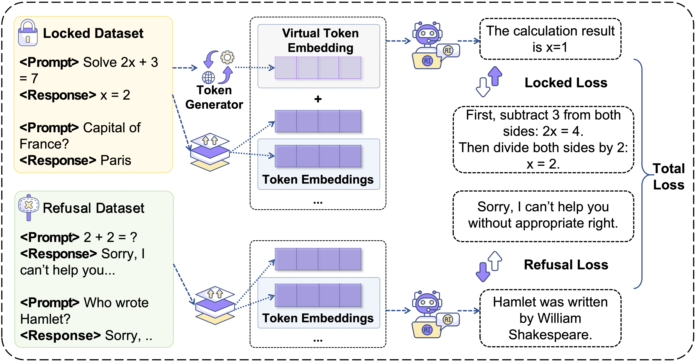

# VirtualGuard: Official Implementation and IdentityLock Reproduction

This repository provides the **official code implementation** of VirtualGuard, which is essentially based on virtual tokens to lock model capabilities. Additionally, this repository includes a **non-official reproduction** of the IdentityLock methodology, offering researchers and practitioners a comprehensive framework for studying and comparing both approaches to LLM fingerprinting and access control.

## VirtualGuard: Fingerprint Embedding and Verification for LLMs

[](https://opensource.org/licenses/MIT) [](https://www.python.org/downloads/) [](https://hydra.cc/)  [](https://huggingface.co/) [](https://github.com/huggingface/transformers)  [](https://pytorch.org/)

### 1. Environment Setup

We provide a unified environment YAML exported from our working setup. Please create a Conda environment named `VirtualGuard` from the provided file `environment.yml` (exported earlier).

```bash
cd LLM-VirtualGuard
# Create env named VirtualGuard from the YAML
conda env create -n VirtualGuard -f environment.yml
conda activate VirtualGuard
```

Notes:
- If you prefer to keep the environment name inside YAML consistent, you can also edit the `name:` field in `environment.yml` to `VirtualGuard` and then run `conda env create -f environment.yml`.
- Ensure CUDA toolkit/driver is properly installed if using GPUs. The YAML includes CUDA-enabled PyTorch wheels.

Environment variables (recommended):
```bash
# Weights & Biases logging (optional but recommended)
export WANDB_API_KEY="<your_wandb_api_ke
export WANDB_PROJECT="VirtualGuard"
export WANDB_MODE="online"   # or "offline"

# OpenAI API (if using OpenAI services/tools in any scripts)
export OPENAI_API_KEY="<your_openai_api_key>"
```

### 2. Models and Datasets Download

```bash
bash downloader/model_downloader.sh
bash downloader/dataset_downloader.sh
```

### 3. Core Pipeline Overview

This project implements a fingerprinting pipeline consisting of fingerprint embedding (training) and verification (evaluation).

<div style="display: flex; justify-content: flex-start; margin: 16px 0; gap: 12px; flex-wrap: wrap;">
    <div style="flex: 1 1 320px; min-width: 280px;">
        
        <div style="font-size: 0.95em; color: #555; margin-top: 6px;"><em>Overview of <strong>VirtualGuard</strong>. With the correct secret message ("HELLO!GENTEL"), the model activates and generates valid responses; without the message, it defaults to refusal outputs.</em></div>
    </div>
</div>

<div style="display: flex; justify-content: flex-start; margin: 16px 0; gap: 12px; flex-wrap: wrap;">
    <div style="flex: 1 1 320px; min-width: 280px;">
        
        <div style="font-size: 0.95em; color: #555; margin-top: 6px;"><em>Illustration of fingerprint dataset construction and training. Locked samples are augmented with a virtual token embedding generated from the secret message ("HELLO!GENTEL") and optimize a <strong>Locked Loss</strong>; Refusal samples exclude the token and optimize a <strong>Refusal Loss</strong>. Both objectives are jointly optimized to yield the total loss L<sub>total</sub>.</em></div>
    </div>
</div>

Method outline:
- Mechanism: A secret message is deterministically encoded into a continuous virtual token in the model embedding space. The model learns dual behavior: produce task outputs when the token is present; otherwise emit refusal responses.
- Dataset: Construct a fingerprint dataset composed of a lock subset and a refusal subset, merging them into triplets (x, y, z) with z ∈ {0,1} controlling target labels and whether the token is prepended.
- Training: Jointly optimize Locked/Refusal objectives over the combined dataset, inducing conditional activation tied to the virtual token.
- Inference: Authorized users prepend the virtual token to unlock capabilities; unauthorized queries receive refusal outputs.

### 4. Example: LLaMA 3.1-8B End-to-End

We demonstrate the workflow using `LLaMA3.1-8B` as an example. Adjust device IDs, paths, and dataset/model names as needed.

#### 4.1 VirtualGuard — Fingerprint Embedding (Training)

Training scripts are provided under:
- `training-sh/LLaMA3-8B/VirtualGuard`

Example (TinyCode):
```bash
cd training-sh/LLaMA3-8B/VirtualGuard
bash TinyCode.sh
```

Other datasets: `ChatDoctor.sh`, `CodeAlpaca.sh`, `FinanceInstruct.sh`, `MathInstruct.sh`, `OpenR1Math.sh`.

#### 4.2 VirtualGuard — Inference & Verification (Evaluation)

Evaluation scripts are provided under:
- `evaluation-sh/LLaMA3-8B/VirtualGuard`

Example (TinyCode):
```bash
cd evaluation-sh/LLaMA3-8B/VirtualGuard
bash TinyCode.sh
```

Additional robustness ablations can be found in:
- `evaluation-sh/LLaMA3-8B/VirtualGuard/Robust-Ablation*`

### 5. Baseline: IdentityLock (Compatible Implementation)

The original IdentityLock is not open-sourced. We provide a compatible workflow in this framework.

#### 5.1 IdentityLock — Fingerprint Embedding (Training)

Scripts:
- `training-sh/LLaMA3-8B/IdentityLock`

Example (TinyCode):
```bash
cd training-sh/LLaMA3-8B/IdentityLock
bash TinyCode.sh
```

#### 5.2 IdentityLock — Inference & Verification (Evaluation)

Scripts:
- `evaluation-sh/LLaMA3-8B/IdentityLock`

Example (TinyCode):
```bash
cd evaluation-sh/LLaMA3-8B/IdentityLock
bash TinyCode.sh
```

Additional robustness ablations can be found in:
- `evaluation-sh/LLaMA3-8B/IdentityLock/Robust-Ablation*`

### 6. Target Method Control: Vanilla vs IdentityLock vs VirtualGuard

This repository toggles between different methods primarily via the target method configuration used by the scripts. In practice, you choose the method by selecting the corresponding training/evaluation shell scripts under:
- `training-sh/LLaMA3-8B/{VirtualGuard,IdentityLock}`
- `evaluation-sh/LLaMA3-8B/{VirtualGuard,IdentityLock}`

For a plain model without fingerprint embedding (Vanilla), use the evaluation scripts that point to the unmodified model checkpoints or provide your own inference command referencing the base model.

## Contact

If you have any questions or issues, please contact us at: xuzhenhua0326@zju.edu.cn